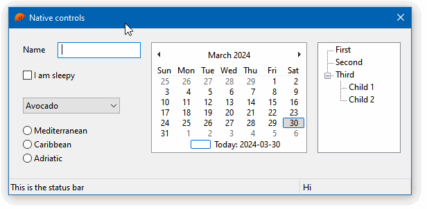

# 02 Native controls

This example showcases several native controls, and how to listen to their events.



To compile and run:

```
cargo run
```

To generate the final executable:

```
cargo build --release
```
