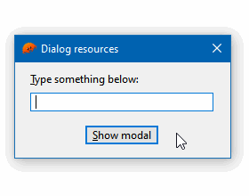
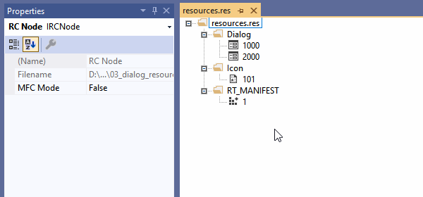

# 03 Dialog resources

In this example we create a main window and, when the button is clicked, a modal window.

Instead of creating these windows programmatically, we load dialogs from the `resources/resources.res` resource file, which was created with the resource editor of Visual Studio 2019. You can edit this file with any [Win32 resource editor](https://en.wikipedia.org/wiki/Resource_(Windows)#Resource_software).

Note how the modal receives a text and returns another.



To compile and run:

```
cargo run
```

To generate the final executable:

```
cargo build --release
```

## Resource editor

Any [Win32 resource editor](https://en.wikipedia.org/wiki/Resource_(Windows)#Resource_software) can be used to edit the resource file.

Out of curiosity, this is the `resources/resource.res` file being edited in Visual Studio 2019 resource editor, using its WYSIWYG interface:


