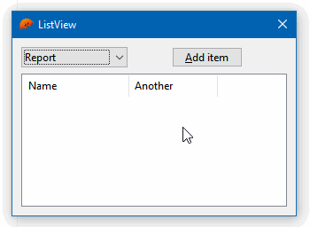

# 06 ListView

The [ListView](https://docs.microsoft.com/en-us/windows/win32/controls/list-view-controls-overview) is, by far, the most complex native control of the whole Win32 API.

This example shows some interactions with this control:

* switching between report and icon views;
* adding a new item with multiple columns;
* deleting the selected items on DEL key.



To compile and run:

```
cargo run
```

To generate the final executable:

```
cargo build --release
```
