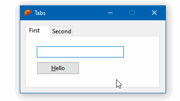

# 06 Tabs

This example shows how to use the `Tabs` widget, which keeps multiple container child windows, displaying only one at a time.



To compile and run:

```
cargo run
```

To generate the final executable:

```
cargo build --release
```
