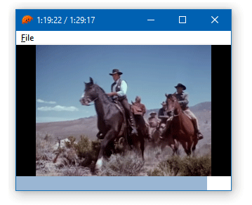

# 06 Video playback

This example is a video playback application which uses [DirectShow](https://docs.microsoft.com/en-us/windows/win32/directshow/directshow), a [COM](https://docs.microsoft.com/en-us/windows/win32/com/component-object-model--com--portal)-based API.

The application is composed of 3 windows:

* `WndMain` – the main application window, which hosts the other 2 windows;
* `WndTracker` – the progress bar at the bottom;
* `WndVideo` – hosts the DirectShow objects and renders the video.

Note that the application includes no video codecs on its own: it will use video codecs already installed on your machine. If you try to load a video to which you don't have the proper codec, it will fail.

Supported files: AVI, MKV and MP4.

The following keyboard shortcuts are implemented:

* Ctrl+O – open a video file;
* Left or right – go backwards or forwards 10 seconds;
* Space – play or pause;
* Esc – close the application.



To compile and run:

```
cargo run
```

To generate the final executable:

```
cargo build --release
```
