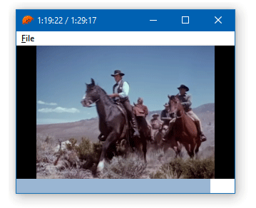

# WinSafe examples

This repo contains several examples of native Win32 applications written in [Rust](https://www.rust-lang.org) with [WinSafe](https://github.com/rodrigocfd/winsafe). All examples follow the same program structure, which is the recommended way to build a WinSafe application.

Each directory is a full application, with is own `Cargo.toml`.

## Resources

Each example has a `.res` file with its [application resources](https://en.wikipedia.org/wiki/Resource_(Windows)) (manifests, icons, dialogs and so on). You can edit the `.res` file with any resource editor, or even generate your own `.res` by compiling a `.rc` script.

The `.res` file is linked into the final `.exe` by the `build.rs`, which is a [Cargo build script](https://doc.rust-lang.org/cargo/reference/build-scripts.html).

## Examples list

Note that the order can change with new examples being added.

| Example | Screenshot |
| - | - |
| 01 [Button click](01_button_click/) |  |
| 02 [Combo and radios](02_combo_and_radios/) |  |
| 03 [Dialog resources](03_dialog_resources/) |  |
| 04 [Custom control](04_custom_control/) |  |
| 05 [Resizable layout](05_resizable_layout/) |  |
| 06 [Video playback](06_video_playback/) |  |

## License

Licensed under [MIT license](https://opensource.org/licenses/MIT), see [LICENSE.md](LICENSE.md) for details.
